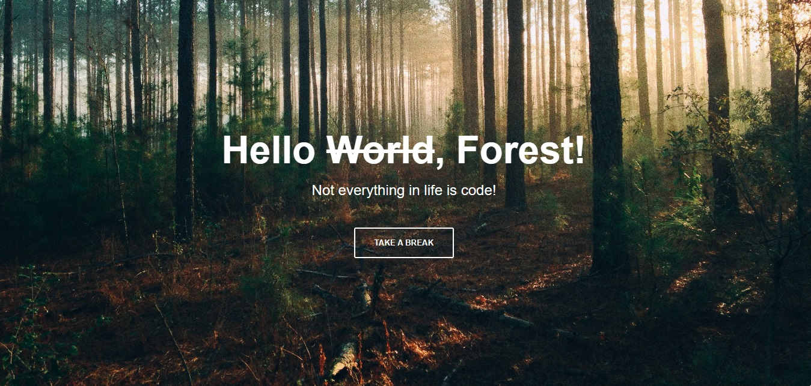

# Hello, Forest!

Este proyecto fue creado como parte del bootcamp de TECNOLOchicas Pro. Es una práctica de diseño utilizando Flexbox y tiene como objetivo mostrar la capacidad de trabajar con diseño responsivo.

## Descripción

El proyecto consiste en una página web simple que utiliza Flexbox para organizar los elementos en el centro de la pantalla. 

## Tecnologías Utilizadas

- HTML
- CSS (Flexbox)

